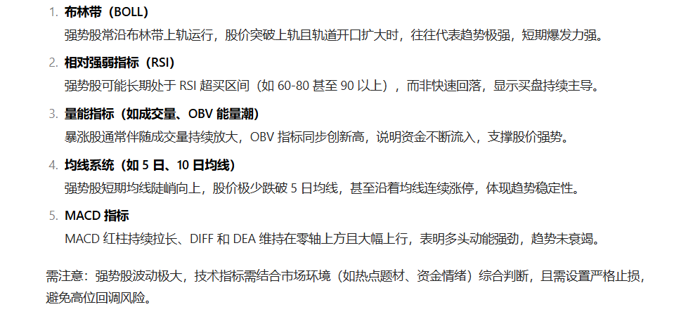
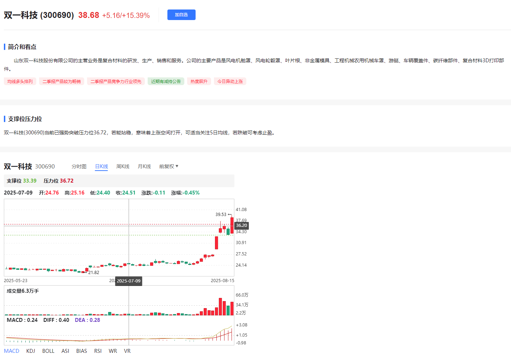
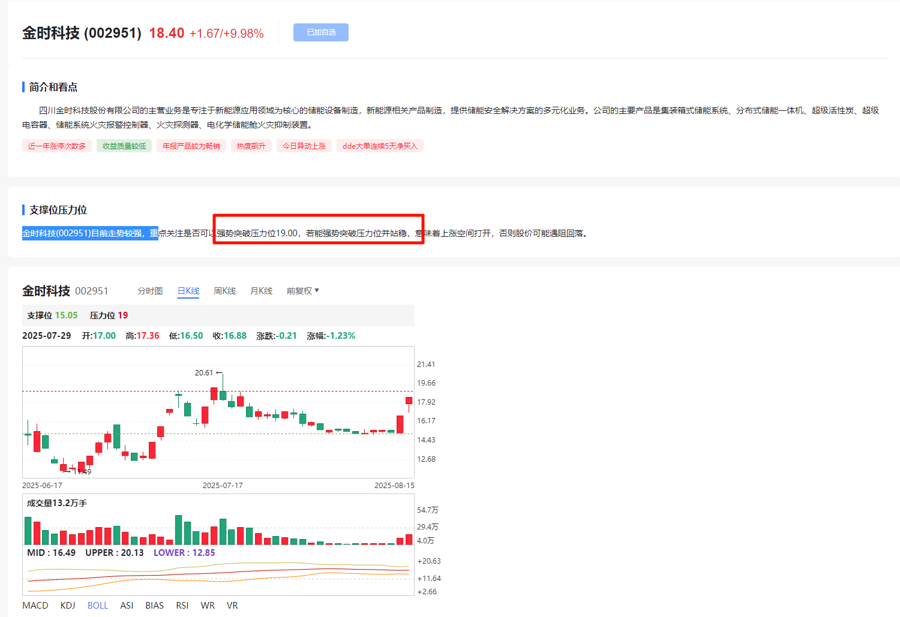
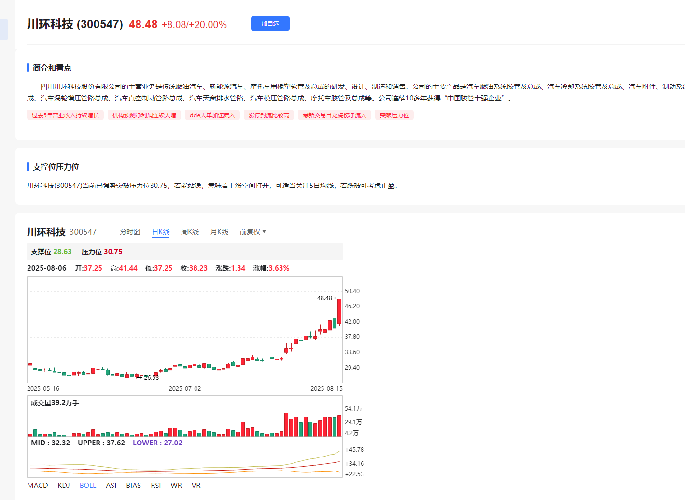
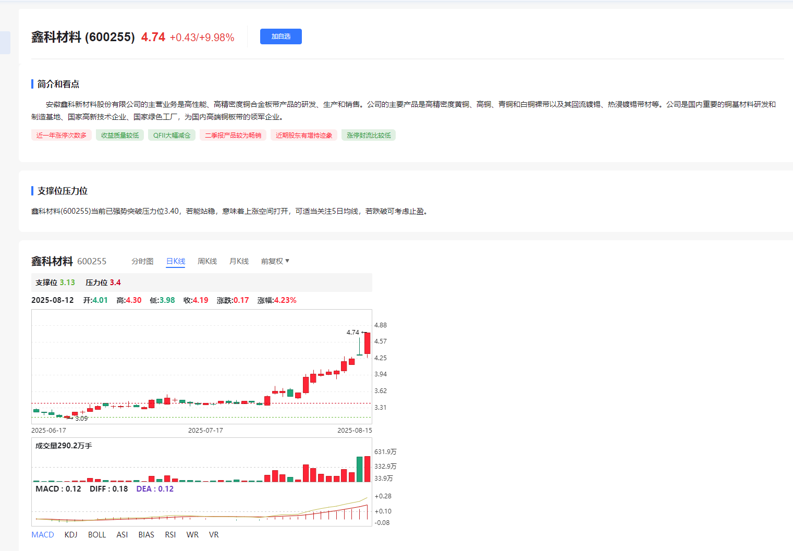
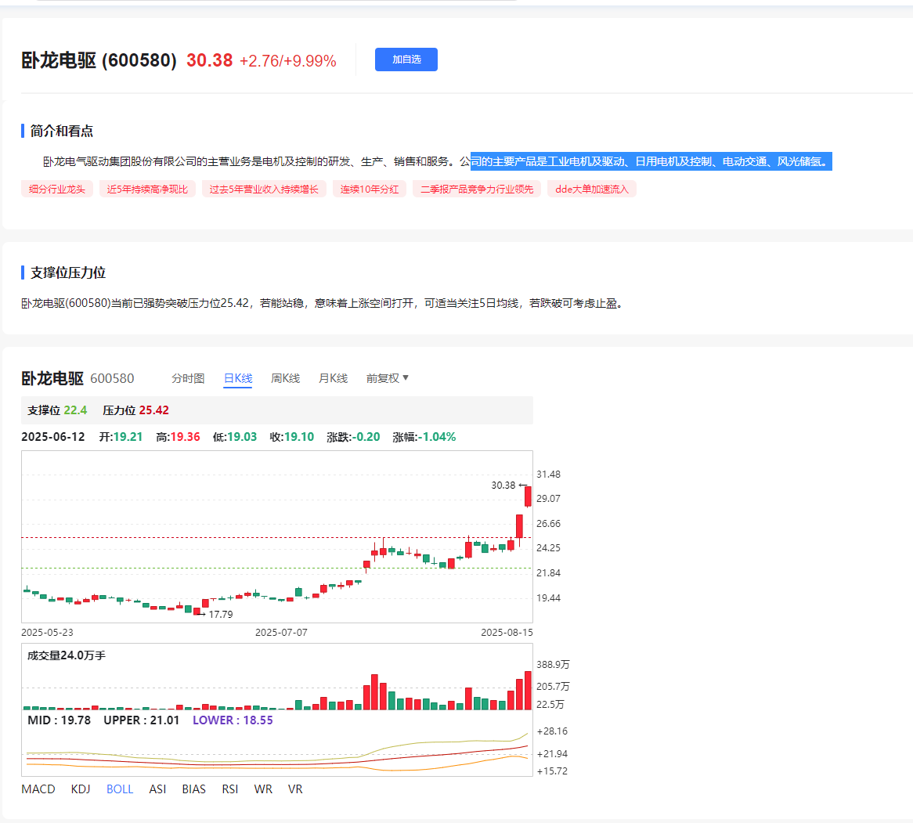

## [礼物]核心关注：
【双一科技300690】：低空经济/Peek材料
【金时科技002951】：数字经济/储能
【川环科技300547】：低空经济/液冷
【鑫科材料600255】：铜缆高速连接/消费电子
【卧龙电驱600580】：低空经济/机器人（核心票加入老师团队可以第一时间收到指导，外部分享有滞后性，能者自行把握回踩机会，把握不好建议关注后面走势，验证实力为主，汇正首席策略师：杨首骏   证书编号：A0070619090002 若据此操作风险自担）

### 双一科技 (300690)  
涨停 38.68  半年报业绩增长+PEEK材料  
强势突破压力位36.72，若能站稳，意味着上涨空间打开，可适当关注5日均线，若跌破可考虑止盈

## 【金时科技002951】：数字经济/储能

【川环科技300547】：低空经济/液冷 

【鑫科材料600255】：铜缆高速连接/消费电子

【卧龙电驱600580】

