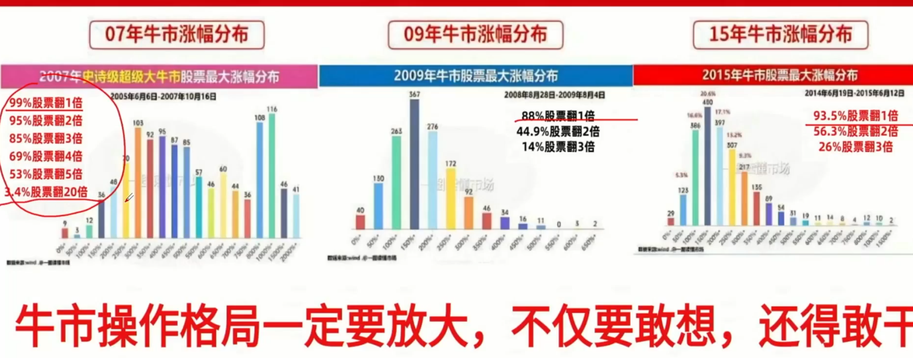

汇正推荐票

擒龙先生
https://www.bilibili.com/video/BV11aYszVETN/?spm_id_from=333.337.top_right_bar_window_history.content.click&vd_source=c68085890d48991315bbc8d4ba53a893

液冷高位加速上涨阶段-->如何处理手中持仓，而不是追了，如何处理过热题材
思路1.高位抱团，低吸，五日线附近，抱紧龙头，英维克，淳中科技，与龙头同生共死
思路2.做低位，中富电路，凌润材料，凌云股份 液冷大概率会复制pcb

创新要核心是依赖期限
创新医疗，利德曼，尚荣医疗，赛诺医疗，博拓生物 没涨多少，尾盘抢筹，资金想做修复，明天有预期差

稀土 低吸
资源 盛和资源，北方稀土，中科磁业，龙磁科技，正海磁材（*），稀土磁材

军工：93阅兵
中科海迅 无人机潜艇，低吸，牛市不要给行情，龙头设限

过热题材要慢慢抽离，要做过热题材要么抱紧高位龙头，要么低位刚启动，中位不要碰
高位盘整，稀土永磁，医疗器械，半导体

注意北交所30cm半导体
腾景科技、晶赛科技--》光刻机 代工龙头地位低吸

高位盘整稀土永磁 挑还有上涨空间的低吸  正海磁材（*），盛和资源，北方稀土，中科磁业，龙磁科技
半导体两个光刻机低吸  腾景科技、晶赛科技
船舶制造  

无人机潜艇，低吸，
液冷抱紧龙头英维克，淳中科技 
不要怕高

汇正：
注意8月中报业绩差的高低切，顺势持有，不要加码
了解结构性牛市思维，板块轮动

要耐心，只有10%翻倍，结构性慢牛
交易量大增，周末消息存款搬家，防止市场震荡这部分资金回调

[红包]8.18日晚核心关注：
【宁波东力002164】：机器人/风电
【奥海科技002993】：机器人/储能
【科创信息300730】：数字货币/算力
【申菱环境301018】：数据中心/液冷
【四方科技603339】：数据中心/液冷
【飞龙股份002536】：机器人/液冷

高低切，新能源
金田股份 机器人液冷概念，宇树，智元合作
双一科技
风电设备，玻璃玻纤
