## 分时图  试盘 测试抛压

试盘三要素：

1. 三倍量以上
   目的是防止主力对到形成的量
2. 带上影线阳线(涨停板，假阴线,阴线不是试盘)
   试盘形态两个特征

- 拉高横盘，最终收阳线
- 拉高动作在一点半之前，主力才能有效测试抛压
  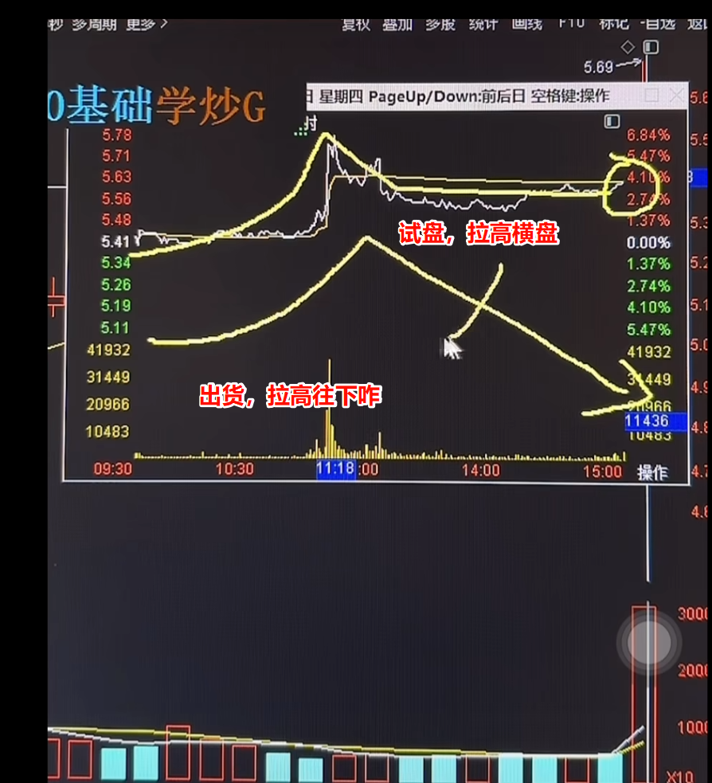

3. 突破前期趋势：突破20日趋势以上
   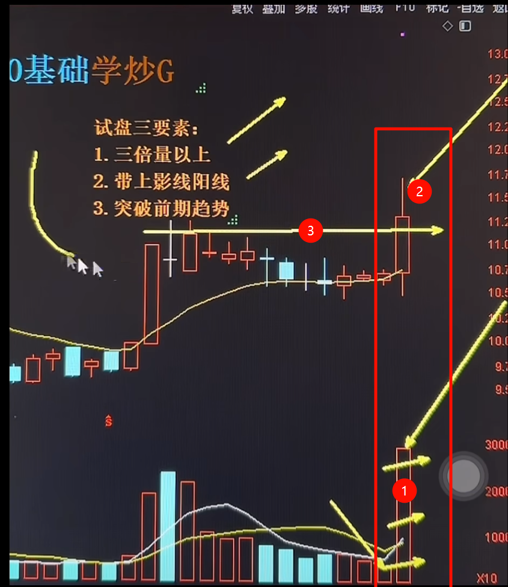

试盘当天不上车，试盘为了测试抛压
如何评测抛压大：最高价和收盘价大于3个点则认为抛压大
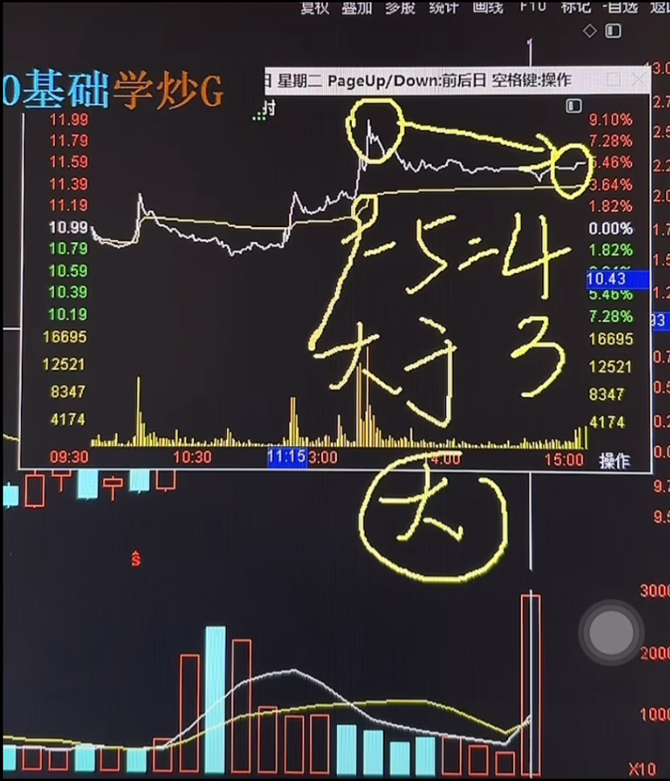

试盘生命线：试盘当天收盘价
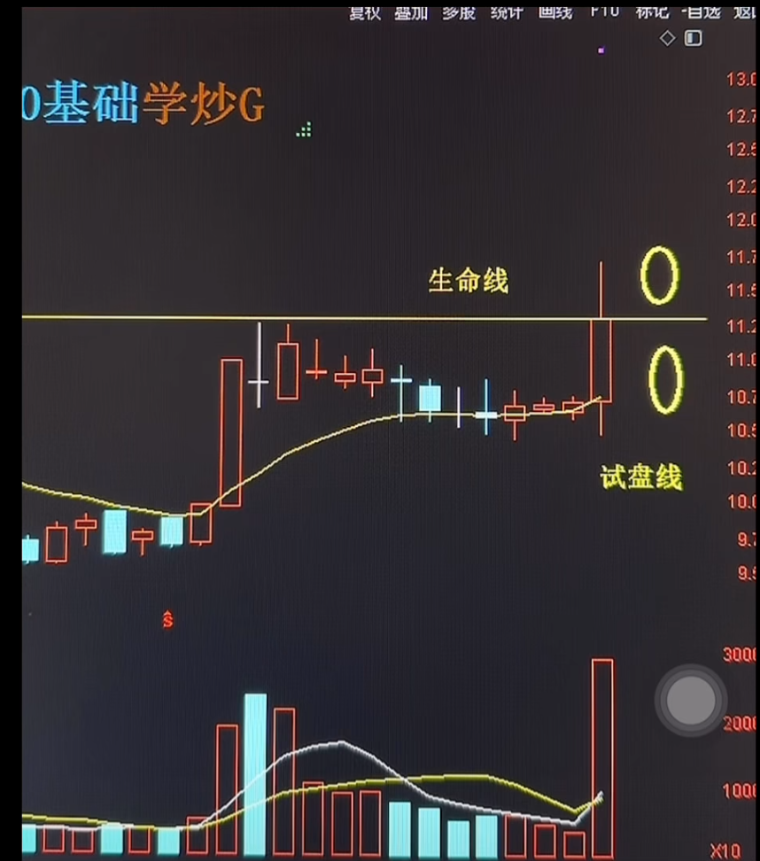
生命线作用：股价站上生命线则可以上车，股价未突破生命线则不能上车，突破是指收盘价高于生命线
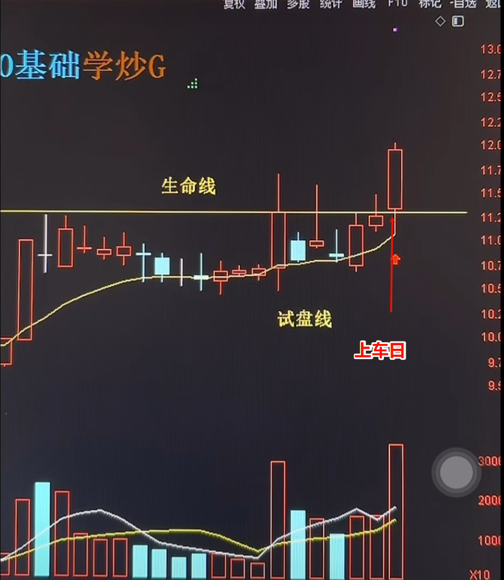
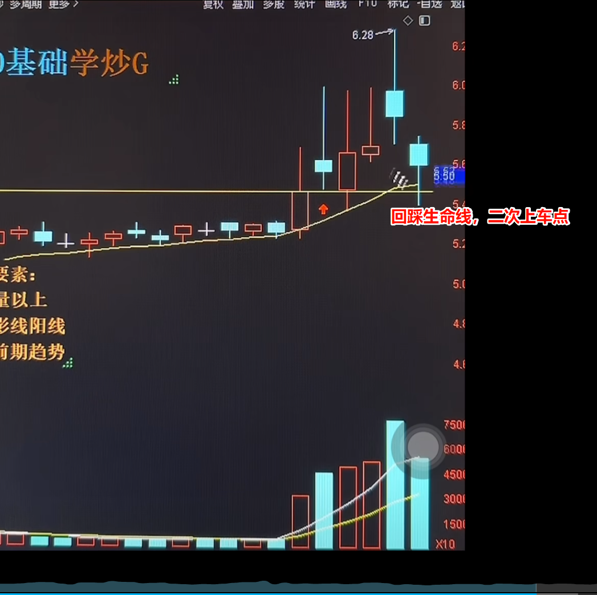

上车策略：突破当天尾盘上车，注意风控，跌破生命线下发3到5个点下车

下车：（判断主力有没有走）

标高量：试盘当天的量
出货量：3倍以上标杆量，并且是阴线则需要下车（或者2个标杆量的阴线）
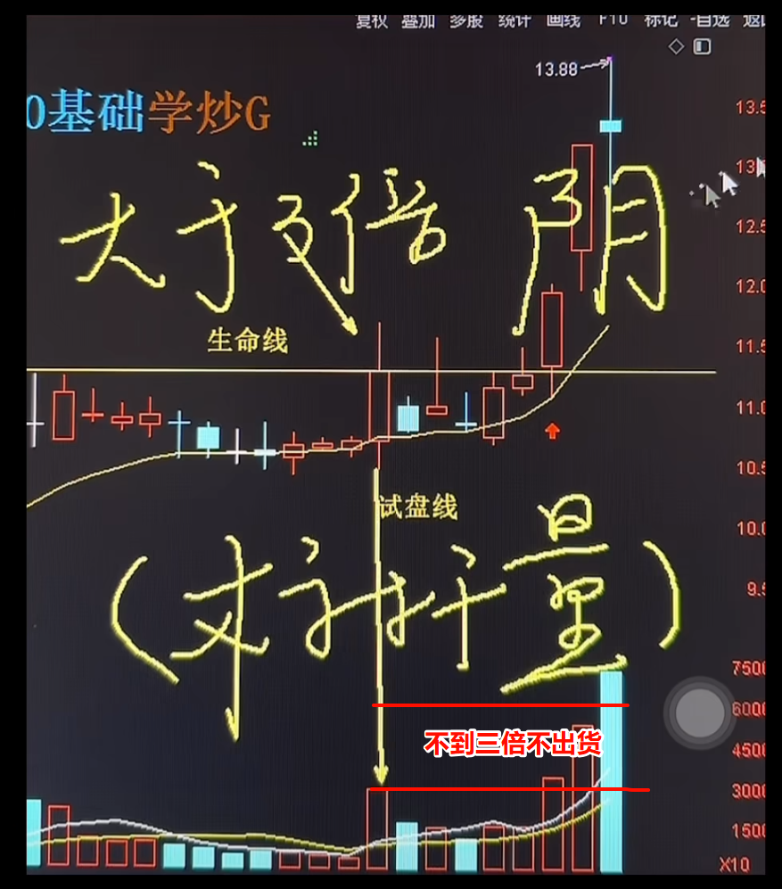
主力未出货，格局等待下观察：
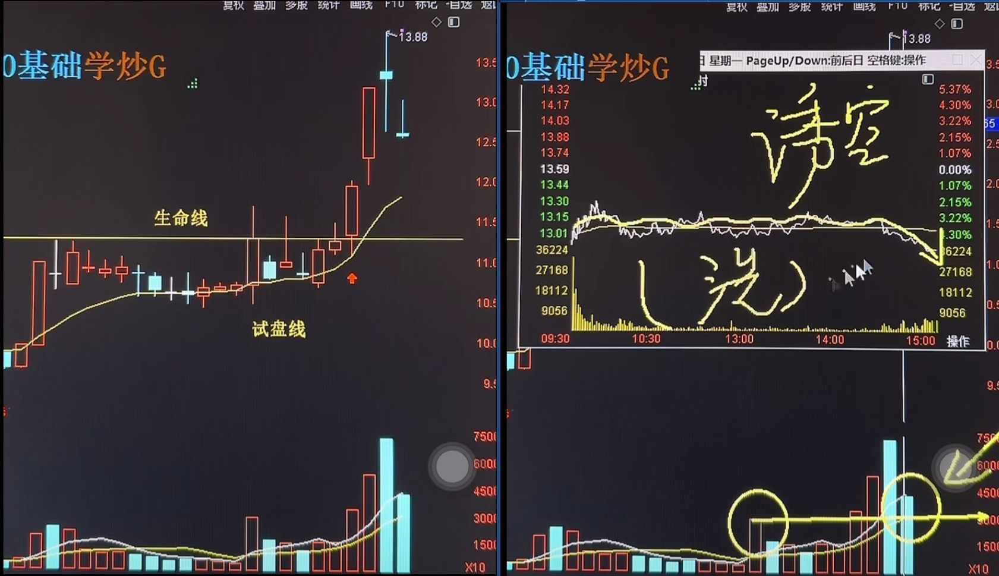

出货量出现，全部下车
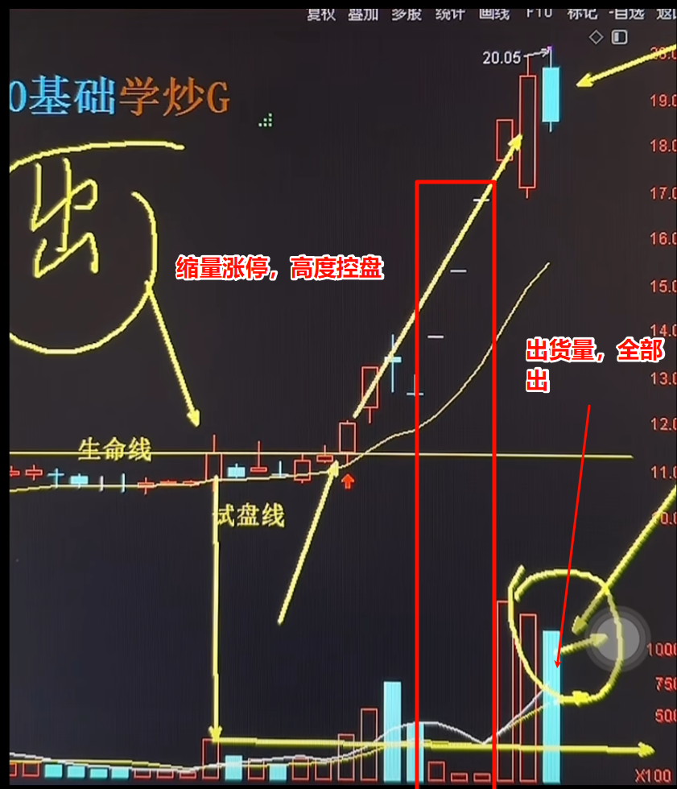

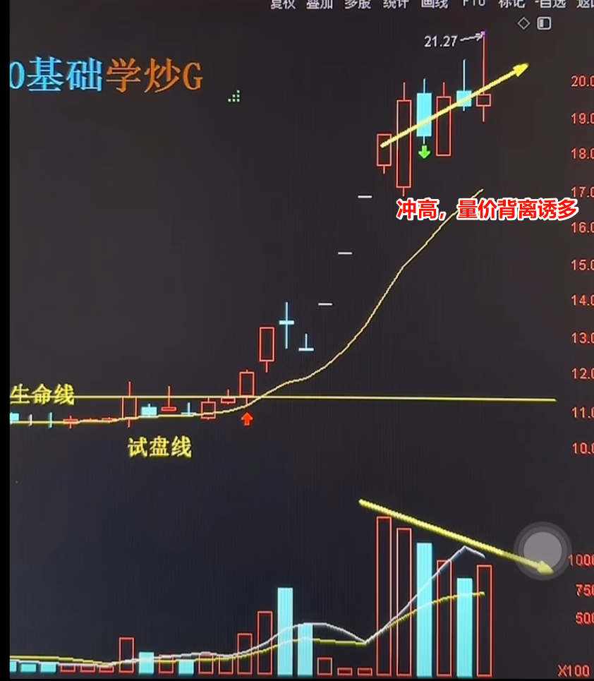

模式要点：

1. 如何找到试盘线的个股：
   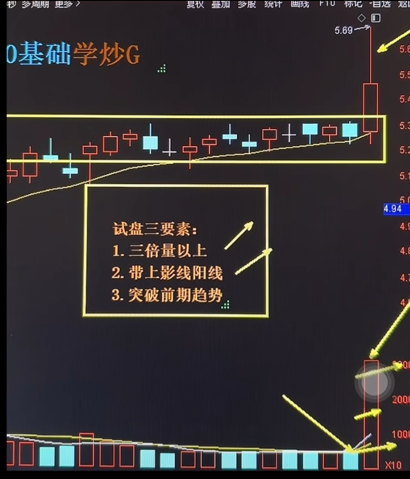

