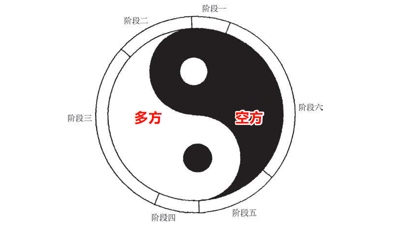

<BiliBili aid="840832784" cid="197199678"/>

#

## 六个阶段

- 阶段一：熊市发展到极致，市场快速下跌，达到低水平；看跌者均已入市，多头绝望斩仓，交易量扩大；但是，阴极而阳生，卖方后继乏力，蜡烛图反转信号出现（在译序图2上，大约从1996年12月到1997年1月间）。
- 阶段二：市场继续维持在低位，转入横向延伸趋势；交易量收缩，市场渐渐尝试上方的水平（大约从1997年春节前到3月初）。
- 阶段三：多头积蓄力量，最终形成向上突破；西方技术信号出现，牛市进入第二阶段；空头且战且退，交易量逐步扩大（大约从3月初到4月下旬）。
- 阶段四：牛市发展到高潮，市场快速上升，达到高水平；看涨者均已入市，空头终于绝望斩仓，交易量扩张。但是，阳极而阴生，买方后继乏力，蜡烛图反转信号出现（5月上、中旬）。
- 阶段五：市场继续维持在高位，转入横向延伸趋势；交易量收缩，市场逐渐尝试下方的水平（5月中、下旬）。
- 阶段六：空头积蓄力量，最终形成向下突破；西方技术信号出现，熊市进入第二阶段；多头且战且退，不过在下降趋势中，交易量既可能逐步扩大，也可能有所减少（6月以后）
