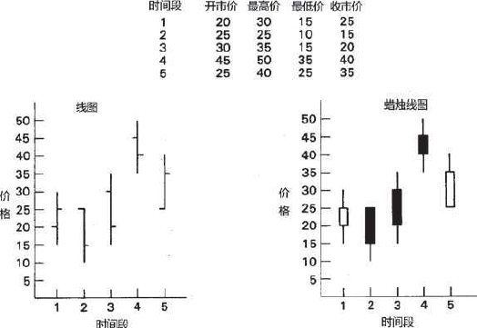
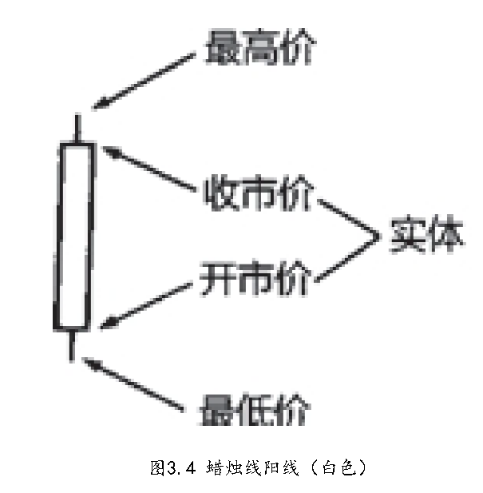
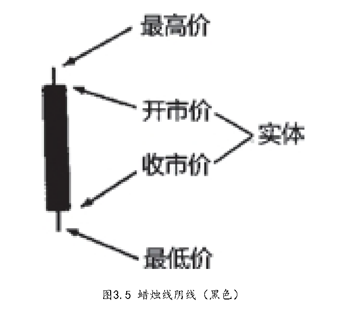
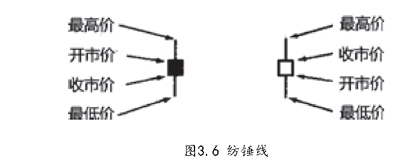
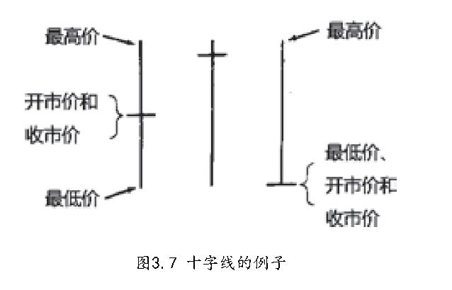

<BiliBili aid="840832784" cid="197200764"/>

## 线图 蜡烛图

- 在每一根蜡烛线中，矩形的部分称为实体。它表示了相应交易日的开市价与收市价之间的价格范围。如果实体是黑色的（即，将之涂满黑色），则代表当日的收市价低于开市价。
  如果实体是白色的（即，将它保留为空白），则表示当日的收市价高于开市价。
- 实体的上方和下方，各有一条细细的竖直线段，称为影线。这两条影线分别表示当日市场曾经向上和向下运动的极端价格。实体上
  方的影线称为上影线，实体下方的影线称为下影线。相应地，上影线的顶端代表了当日的最高价，下影线的底端代表了当日的最低价。
- 如果某根蜡烛图线没有上影线，那么它就是所谓的光头蜡烛线。 如果某根蜡烛线没有下影线，那么它就是所谓的光脚蜡烛线
- 实体的部分代表了“实质性的价格运动”，通过实体长度和颜色，一眼便能看出当前 行情的图形线索，到底多头占上风还是空头占上风

> 
> 牛占上风，因为在当前时间段内市场的开市价差不多就是其最低价，而收市价接近最高价
> 
> 表示市场的开市价接近当日最高价，收市价接近当日最低价，说明至少在当前时段内，熊占上风

- 从实用角度来说，可以采用实体长度作为市场动量指标

> 在 K 线图中，实体长度反映了开盘价和收盘价的价差。实体长说明价格波动大、买卖双方力量对比变化大，市场动量强；实体短则波动小、力量变化小，市场动量弱，所以能用来衡量市场动量。

## 纺锤线

长白线和长黑线代表着一边倒的单边行情，那么当实体缩小时，我们就能得到线索，之前的行情势头或许正在减缓
纺锤蜡烛线的上下影线到底是长是短是无关紧要的。正是因为纺锤线的实体非常小，纺锤线才成为纺锤线。
>
长白线是价格大幅上涨，长黑线是大幅下跌，这都是一方力量很强的单边行情。实体缩小，就是开盘价和收盘价差距变小，说明之前那种一边倒的涨跌趋势在变弱，行情势头不像原来那么猛了。纺锤线实体小，就体现了这种多空力量逐渐平衡、趋势放缓的状态 。

## 十字线

没有实体，，蜡烛线的实体实际上缩小为一根水平横线
十字线带有反转信号的意味 (todo 思考：注意十字线在周期内翻转次数)
> 十字线开盘价和收盘价相近或相同，说明多空双方在这个时间单位内力量均衡，之前的趋势动力减弱。如果之前是上涨或下跌趋势，此时出现十字线，意味着趋势可能难以为继，有转向的可能，所以说它带有反转信号的意味。

四个价格：

- 开盘价：开市价为我们研判当日的市场方向提供了第一条线索。从时间上来看，正是在开市这一重要时刻，夜间发生的所有的
  新闻和小道消息，在经过市场参与者的过滤、选择之后，全部融汇在 一起了。（思考，和上日收盘价格的关系，通过上日线和今日开盘线，三者关系判断今日趋势）
  > 跳空指的是股价或期货等交易品种的价格在连续交易时段中，某一交易日的最低价高于前一交易日的最高价，或最高价低于前一交易日的最低价，从而在 K 线图上留下一段没有交易的空白区间
- 最高价
- 最低价
- 收盘价: 在关键图形位置，市场波动大，价格可能假突破。收市价是多空双方当日博弈结果，收市时价格突破关键位并保持住，说明突破有较大真实性，参与者据此判断趋势变化，决定交易策略，所以要等收市价来验证突破信号。
>  有人在市场上打出巨额买进指令或卖出指令，企图影响收市价格的水平，日本人就把这类行为称为“夜袭”。如果这种行为发生在开市时，自然就被称为“拂晓袭击”。
>  这么做通常是为了操纵市场价格，获取利益。通过在收盘或开盘时投入巨额买卖指令，影响价格走势，误导其他投资者，让自己在后续交易中，从价格变化里获利，或者实现控制市场等目的。

日本蜡烛图技术4 正确认识反转形态