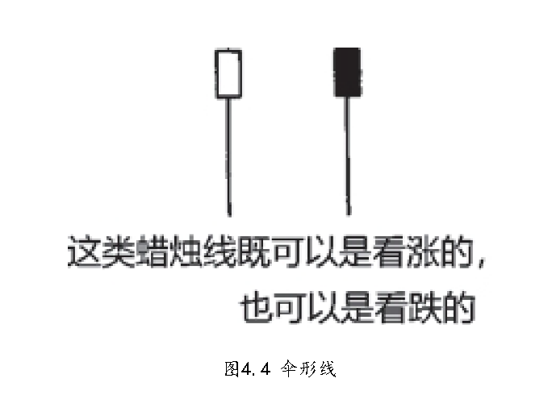
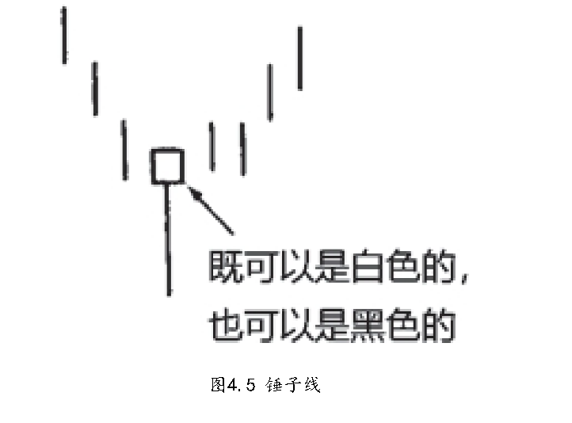

<BiliBili aid="840832784" cid="197201063"/>

从力量分析，下影线长，表示做空力量使劲发力，但又收回了，说明多空纠结，趋近平衡，可能反转，开始决斗，多空近似，需要结合形态和趋势分析
单单看上吊线意义不大，和下一日出现跳空意义比较大，表示多空决斗结果明确

吞没形态注意夜袭

## 蜡烛图反转信号的第一种类型

### 伞形线:锤子线和上吊线

- 伞形线：下影线较长，而实体（或黑或白）较小，并且在其全天价格区间里，实体所处的位置接近顶端
  
- 锤子线（“探水竿“：探一探河底，估计一下水的深浅）
  伞形线，不管是哪一种，只要它出现在下降趋势中，那么，它就是下降趋势即将结束的信号。在这种情况下，这种蜡烛线称为锤子线，意思是说“市场正用锤子夯实底部”，
  
- 上吊线
  伞形线，不管是哪一种，出现在上冲行情之后，那么，它就表明之前的市场运动也许已经结束

从

