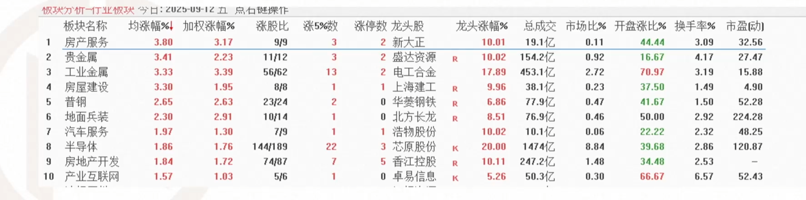

#

在交易中只有两个最重要的指标。一个是价格，另一个是成交量。如果分开来看，它们每个都作用有限而
且不能揭示出什么信息，但是如果综合起来运用，就像火药一样，它们就会成为爆炸性的组合。一旦您亲
身感受到了量价分析的力量，您就会非常震惊并且异自已为什么之前一直没有用过这个方法。

- 不要在没有成交量的地方浪费时间
- 辨别价格运动是真实的还是虚假的唯一方法就是通过分析成交量。因为成交量是不可能被隐藏的，它就展示在那里供所有人
  观察。成交量对价格有验证作用，某些关键价位的突破，某些形态的完成需要成交量验证。

注意高低为切换，不要过多恋战

立讯精密 工业富联 消费电子
  
科技板块 人工智能

算力 半导体

周末好呀，公司昨天又举办了一年一度的公司运动会，也是趁此机会运动一下[呲牙]

[玫瑰]另外帮您准备了咱们葛路老师投教课，记得可以收藏学习：

第一节-基本面分析：https://ch.shhztl.com/chain/ANI6EQE0
第二节-技术面分析：https://ch.shhztl.com/chain/x8KueXob
第三节-投资情绪分析：https://ch.shhztl.com/chain/ii28PfN7
第四节-预期管理：https://ch.shhztl.com/chain/Ae8O7IZH
第五节-应对市场波动：https://ch.shhztl.com/chain/MHBS2WEG
第六节-风险控制：https://ch.shhztl.com/chain/YkbEEPPs
第七节-实例一：https://ch.shhztl.com/chain/1GkO5OIF
第八节-实例二：https://ch.shhztl.com/chain/itkwYnQk

牛市追涨可以，别杀跌就行这话合理，但是多数人追涨也杀跌。在这个情况下，直接跌的时候低吸，这样多数人能拿得住。追涨的话第二天回调了，很多人就害怕割了